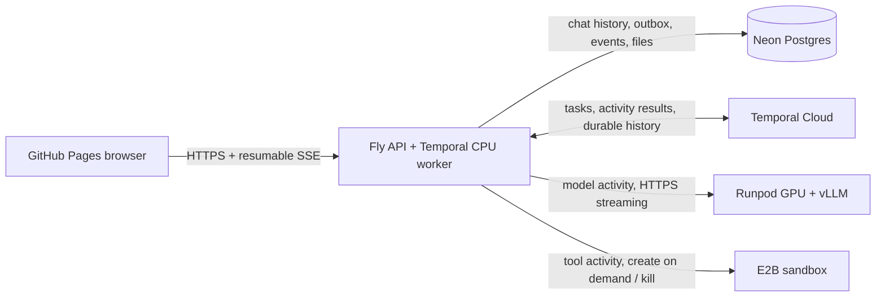

# Stream Chat

A personal React/Vite chat app on GitHub Pages, a Fly.io HTTPS/SSE API, Neon managed Postgres history, and a Runpod Serverless GPU worker that scales from zero to one. The API calls the worker over authenticated HTTPS streaming. The worker calls vLLM on localhost.

## Deployment

- Chat: https://andychenyh.github.io/stream-chat/
- API: https://stream-chat-andy.fly.dev
- Runpod endpoint: `3bjnfx7c4y7izs` (zero active workers, one maximum).
- Database: Neon Free project `stream-chat`, Postgres 16 in AWS Oregon.

Local source is in `~/Coding/stream-chat`. Deployment secrets are in the ignored, mode-0600 `.secrets/fly-serverless.env`; `CHAT_ACCESS_KEY` unlocks the personal workspace. Keep this file private.

## Request flow

1. The browser sends a prompt and personal access key to Fly. With Temporal enabled, Fly atomically saves the prompt, frozen agent configuration and dispatch record in Neon. A durable Temporal queue admits one active run and five waiting runs.
2. Once its turn starts, Fly emits `starting` and makes authenticated readiness requests to Runpod. Runpod starts a GPU worker if none is running. Login and health probes never start a worker.
3. The worker resolves Runpod's cached model, loads vLLM, and reports ready. Fly submits a generation request and forwards token chunks immediately over SSE. With Code tools enabled, completed native tool calls return to Fly, which executes them in E2B and sends the results back to the model for another round.
4. The completed reply is committed to Postgres before Fly sends `done`. Failed or cancelled partial responses are not saved as completed assistant replies.
5. Runpod stops the worker after 60 idle seconds. Conversation history remains in Neon, which can also sleep when idle.

## Security and limits

The personal access key lives only in browser tab memory and Fly secrets. Every conversation endpoint requires it; the single key grants access to the whole personal workspace. The frontend contains only the public API origin.

Fly verifies Runpod's HTTPS certificate and authenticates with a Runpod API key. The worker separately verifies `X-Worker-Key`, so direct worker access also requires service authentication. Neither credential is sent to the browser or baked into the image. Runpod's internal `/ping` is a readiness-only endpoint. vLLM binds exclusively to localhost; no direct TCP ports, SSH, or Jupyter are needed.

Deploy exactly **one Fly Machine with one Uvicorn process**, **one maximum Runpod worker**, and vLLM `max-num-seqs=1`. Temporal permits one active agent and five queued requests; the GPU independently rejects overlapping generations. The worker rejects overlapping generations. This is not a multi-user authentication system.

Readiness GETs retry for at most 240 seconds; authentication failures stop immediately. Each model activity makes one generation POST. The SDK permits one explicit replacement attempt after an interrupted model call; it counts against the eight-call budget and replaces partial output in the browser. Each model round is limited to 180 seconds and 1024 output tokens, with a 720-second deadline for the entire request including queueing. The absolute run deadline includes queue waiting; expired requests do not start inference. A 10-second SSE heartbeat keeps the browser connection active during startup. Stop cancels the request; cancellation of startup leaves any already-starting worker to Runpod's idle timeout. A 60-second idle timeout and max-workers=1 are not a hard monthly spending cap.

## E2B code tools

The composer has a **Code tools** checkbox and **Add file** control. With tools enabled, Qwen can call `terminal(command)`, `python(code)`, and `publish_file(path)`. The worker uses vLLM's native Hermes tool parser; text/code fences are never interpreted as commands. Fly waits for a complete, validated response before executing a tool. Tools run sequentially, with at most six tool attempts and eight model calls. Turning tools off selects the chat agent with an empty tool allowlist.

Fly creates one E2B code-interpreter sandbox on the first tool call, after GPU startup. No sandbox starts for a text-only answer. Commands and Python cells have a 30-second limit; the sandbox has a fixed 180-second provider timeout with kill-on-timeout and no auto-resume. In durable mode it is killed as soon as the run finishes, fails, or is explicitly cancelled. A browser disconnect does not cancel execution. After a backend restart, activities reconnect to the existing sandbox without extending its hard lifetime. If it has expired, the run fails honestly rather than claiming to restore Python memory. Cancellation during creation waits briefly for the sandbox ID so it can still be killed. A failed cleanup is shown in diagnostics; the provider timeout remains the fallback. Sandbox memory/files persist between tools in one request, never between requests.

The sandbox has no outbound internet and receives no Fly, Neon, Runpod, or E2B API credentials. E2B's API key is a Fly secret (`E2B_API_KEY`). The model receives uploaded file paths, and Fly stages conversation files into `/home/user/files/` only when a tool actually runs. Python includes common analysis packages. Use `plt.show()` for PNG plots and `publish_file` to preserve other files. Executable code stays in E2B; the backend never executes generated commands locally.

Inputs, saved output files, and tool commands/results persist in Neon and are accessible from another client using the same personal key. Raw sandbox files disappear on termination. Files are limited to 2 MB each, 20 per conversation and 100 MB total; each task can publish up to six outputs. Downloads require the access key and use attachment responses; only validated PNGs are displayed inline. Tool history shows the latest 100 steps for a conversation. Run events are buffered in Neon for up to 24 hours so another client can follow the same run. Browser timing counters describe the current connection.

Before creating a sandbox, Fly reserves its full 180-second lifetime in Postgres. Confirmed termination refunds unused time; ambiguous creation/cleanup retains the full reservation. The app blocks creation beyond 3,600 reserved seconds in a rolling 24 hours or 36,000 seconds total. These limits survive restarts and apply across clients. At the default 2-vCPU/4-GiB E2B rate of $0.000046/second on 2026-09-19, ten hours is about $1.66 of credits. This is an application time allowance, not a provider-enforced dollar cap, and excludes Runpod and Fly charges. No card, credit purchase or paid upgrade is configured by this feature. Increasing the fixed allowance requires an intentional backend change.

## Repository

- `frontend/`: React UI, SSE parser, GitHub Pages build.
- `agent_sdk/`: reusable Agent, Tool, Limits definitions and V1 Temporal workflows.
- `backend/agents.py`: application agents; `backend/tools.py`: separate tool definitions.
- `backend/`: authentication, model/sandbox activity adapters, transactional outbox, history and resumable SSE.
- `worker/`: HTTP wrapper, model cache resolver, and vLLM container startup.
- `shared/`: stream framing and body limits.
- `tests/`: authentication, cold starts, cancellation, stream completion, context limits, and Postgres persistence.

## Local checks

Use Python 3.12, Node 24, and pnpm 11.19.0. Create a virtual environment, then run `pip install -r requirements-dev.txt` and `pytest -q`. Set `TEST_DATABASE_URL` to a dedicated disposable Postgres database to include the database test; otherwise it is explicitly skipped. CI runs the database and durable execution tests against Postgres 16 and a real local Temporal development server. External model and sandbox providers are simulated in CI, so tests consume no provider credits. Set `TEST_TEMPORAL_ADDRESS=127.0.0.1:7233` for local integration tests; `CI=1` lets the SDK start an ephemeral Temporal server. A committed synthetic history is replayed on every test run.

Run `pnpm install --frozen-lockfile`, `pnpm test`, and `pnpm build` in `frontend/`. `pnpm dev` defaults to `http://127.0.0.1:8080`. For a real local backend, set the variables in `.env.example` in the shell and run `uvicorn backend.main:create_app --factory --port 8080`. There is no production mock-model fallback.

## Runpod Serverless configuration

Build the **Build GPU worker image** GitHub Actions workflow and use its commit-tagged image. Configure a **Load Balancer** endpoint, not a queue-based endpoint:

| Setting | Value |
|---|---|
| Active/minimum workers | 0 |
| Maximum workers | 1 |
| GPUs per worker | 1 |
| GPU tiers | 16 GB preferred, 24 GB fallback |
| Idle timeout | 60 seconds |
| FlashBoot | Enabled |
| Cached model | `Qwen/Qwen3-4B-Instruct-2507` |
| HTTP port / `PORT` | 80 |
| Health path / `HEALTH_CHECK_PATH` | `/ping` |
| `PORT_HEALTH` | 80 |
| Direct TCP ports | None |
| `WORKER_SERVICE_KEY` | Random secret, minimum 32 characters |
| `MODEL_NAME` | `Qwen/Qwen3-4B-Instruct-2507` |
| `MAX_MODEL_LEN` | 8192 |
| `REQUIRE_MODEL_CACHE` | 1 |

The vLLM base image uses CUDA 13.0.2. Select a compatible host driver (CUDA 13.0 or newer). `--enforce-eager` avoids graph/compilation startup work, trading some steady-state performance for startup speed. The worker requires the Runpod model-cache mount; if missing, it fails rather than silently downloading weights during billed worker time. No network volume is required for conversation history.

The Runpod API key should be scoped to this endpoint's request access where supported. Keep `WORKER_SERVICE_KEY` in Runpod's secret store and inject it as an environment variable. Configure the same service key in Fly. Container images contain source and dependencies only.

## Neon and Fly configuration

Create a Neon project on the **Free** plan. Keep its compute small and scale-to-zero enabled. Store the TLS Postgres connection string in Fly as `DATABASE_URL`. Idle pool connections close after 30 seconds, and Fly's `/healthz` probe makes no database or model requests, so it does not prevent scale-to-zero. Deploy one API process. Startup preserves Temporal runs; only legacy requests are marked interrupted.

Fly secrets: `DATABASE_URL`, `CHAT_ACCESS_KEY`, `RUNPOD_ENDPOINT_URL`, `RUNPOD_API_KEY`, `WORKER_SERVICE_KEY`. The endpoint origin has the form `https://ENDPOINT_ID.api.runpod.ai`; arbitrary hosts and plain HTTP are rejected. Configure `ALLOWED_ORIGINS` to the GitHub Pages origin, without a repository path.

Use `fly deploy --ha=false --strategy immediate`, and keep exactly one Machine. The included config requests one shared CPU and 512 MB in `sjc`. Fly is the always-available entry point; GPU and database compute sleep independently.

## GitHub Pages

The repository variable `API_BASE_URL` is the Fly HTTPS origin. Set Pages source to **GitHub Actions** and use the included frontend deployment workflow. Vite uses relative assets for project Pages URLs. Never place credentials in `VITE_` variables.

## Live request diagnostics

Each request shows a live status panel with a timestamped event timeline, request ID, elapsed time, time to first token in the browser, readiness attempts and HTTP results, heartbeat freshness, stream chunk/character counters, and chunk throughput. Startup snapshots report Runpod's actual worker counts every five seconds while a readiness probe is pending. Those control-plane reads do not wake another GPU. Provider failures only disable telemetry, not inference.

Worker events distinguish tokenization/context trimming, vLLM submission, the local runtime stream opening, first output, streaming, and the final Neon commit. vLLM reports exact input/output token usage at completion; live chunk counts are explicitly not token counts. Runpod does not separately expose image download, model download, and runtime load percentages through this API, so the UI leaves those stages uncertain. Failures include the last known stage, exception type, and upstream HTTP code without exposing credentials or raw provider response bodies.

In durable mode, events carry sequence IDs and reconnect from the last received event. Opening an active conversation on another client replays its buffered events and follows the same run. Stop requests server cancellation and waits for confirmed completion/cleanup. Permanent conversation text, tool results and files remain in Postgres; the temporary event buffer is pruned after 24 hours.

## Verified behavior

E2B tools were tested end to end on 2026-09-19 against the deployed Fly API and Runpod model. A CSV task executed a terminal command, recovered from two Python errors, computed total 450 / average 150, generated a PNG plot and published a CSV. The saved answer, plot and file were fetched again after sandbox termination. Closing a second request immediately after sandbox creation persisted cancellation and left zero E2B sandboxes. A text-only request with Code tools enabled did not change sandbox usage. The two sandbox runs reserved 48 seconds after confirmed cleanup (about $0.0022 at the default compute rate). The initial GPU cold start took about 75 seconds; the analysis finished in 124 seconds. These are individual test measurements.

The deployed path was tested on 2026-09-16 with Qwen3 4B on an RTX A5000:

- Scale from zero running workers: 90.4 seconds to first token, 91.4 seconds to finish a short answer.
- Warm follow-up: 0.73 seconds to first token, 1.1 seconds total.
- Completed replies survived browser reload; queued and active generation cancellation preserved the prompt without saving a partial assistant reply.
- Unauthenticated Fly requests and Runpod requests missing the separate worker service key returned 401.

These are individual measurements, not latency guarantees. The first host had to download and extract the container image before loading the model; that initial setup took several additional minutes. Runpod reported $0.00019/second for the A5000 worker, including running idle time. At that rate, a 90-second billed startup/generation plus a 60-second idle tail would cost about $0.029; provider scheduling delays can be unbilled. The preferred 16 GB tier starts at $0.00016/second. Check Runpod billing for actual charges.

## Acceptance and operations

Verify a real cold request streams, its completed response survives a page reload, a warm follow-up is faster, Stop cancels generation, unauthorized API and worker requests fail, and the worker count returns to zero after idle timeout. Measure startup and first-token latency on the chosen GPU rather than relying on generic cold-start claims.

GPU time is billed during startup, execution, and idle timeout. Storage is billed separately. No credit recharge or automatic budget purchase is configured by this application. An exhausted balance or provider quota makes generation unavailable. After a prolonged unused period, Runpod may disable an endpoint; restore its maximum workers to one when needed. Keep provider access keys and the personal chat key in a password manager.

In durable mode, Temporal owns the queue and agent execution state. Duplicate request IDs with the same input reconnect to the accepted run; changing the input under an existing ID is rejected. If Temporal is temporarily unavailable, accepted prompts remain in the Neon outbox until delivery or expiry. Neon plan quotas apply to both storage and compute.

## Our agent SDK and Temporal

Durable mode is enabled by `TEMPORAL_ADDRESS`, `TEMPORAL_NAMESPACE`, and `TEMPORAL_API_KEY` in Fly secrets. Until configured, the existing legacy execution path remains available for rollback. `/v1/status` reports `durable_execution` and the worker connection status; do not assume Cloud is enabled just because the source is deployed.

```python
from agent_sdk import Agent, Limits

analyst = Agent(
    name="analyst",
    version=1,
    system_prompt="Help me analyze data. Use tools when needed.",
    tools=("python", "terminal", "publish_file"),
    limits=Limits(
        max_model_calls=8,
        max_tool_calls=6,
        max_validation_retries=1,
        max_model_retries=1,
        max_output_tokens=1024,
        run_timeout_s=720,
    ),
)
```

Register agents in `backend/agents.py`; reference tool names from `backend/tools.py`. Each tool has a Pydantic argument model and a timeout. The workflow checks its frozen JSON schema and allowlist before scheduling execution; the activity independently validates with the tool registry. Invalid arguments consume an attempt and can be corrected once. Unknown names never execute. The limits above are total budgets for one run, including corrections and restarted attempts, not per-tool allowances.

For a structured final answer, set `output_type=YourPydanticModel`. Its JSON Schema is frozen in the run. Final output must parse as JSON and validate against that schema before it is saved. vLLM also receives `response_format` on rounds where tools are disabled. Python-only Pydantic custom validators are not serialized into the schema; express required output constraints in JSON Schema. Provider enforcement is additional protection, not a substitute for the SDK validator.



The CPU worker runs in the existing Fly process; Temporal Cloud itself does not run on Fly. Cloud records workflow inputs, activity results, timers and decisions. It does not receive API keys or file bytes. Neon holds permanent product data, the dispatch record, the temporary browser event buffer and sandbox usage reservations. Tool result rows also serve as execution receipts: if a command was claimed but its outcome was not durably recorded, the activity reports `OutcomeUnknown` and never blindly repeats it. A recorded completed receipt can be returned without running code again. This is conservative at-most-once command dispatch, not a claim of exactly-once external side effects.

A failed model attempt can be restarted once, explicitly counted. Safe database/cleanup activities retry up to three attempts. Workflow execution has no automatic whole-run retry. Each run has an absolute deadline, and a separate hard workflow timeout covers a completely unavailable worker. E2B's 180-second kill timeout is the final cleanup backstop even if both Fly and Temporal are unavailable. GPU lifecycle remains Runpod's scale-to-zero policy.

The durable queue is `AgentQueueV1`; one child `AgentRunV1` executes each request. Queue history continues as new after 100 requests. Keep V1 command ordering replay-compatible. Introduce a V2 workflow and task queue (keeping V1 workers until old work drains), or use Temporal's documented patching/versioning, for incompatible changes. Agent prompts/schema/limits are frozen when accepted. Do not change pending V1 tool handler semantics without a versioned rollout. CI includes restart, cancellation, duplicate acceptance, ambiguous-command, schema-repair, deadline, budget and history-replay checks.

### Enable Cloud after account approval

1. Activate a Temporal Cloud account and create a namespace near Fly, with short retention (for example 7 days). Cloud signup currently requires a payment method and converts to paid usage when trial credits expire or run out; account activation is separate from code deployment.
2. Create a service identity/key restricted to this namespace's workflow access. Set `TEMPORAL_ADDRESS` to the namespace endpoint, `TEMPORAL_NAMESPACE` to the full namespace name, and `TEMPORAL_API_KEY` in Fly secrets. These never belong in frontend variables, Git or E2B.
3. Build and deploy the new GPU worker image first. Agent requests require its `X-Agent-Protocol: 1` response header; the old worker fails closed rather than silently ignoring agent configuration.
4. Deploy the Fly backend on its existing single 512 MB machine, then the frontend. No extra persistent GPU or Fly machine is required by the design.
5. Verify a real tool request, reconnect from a second client, explicit cancellation, saved files, and sandbox/GPU shutdown. The local test suite cannot establish live provider credentials or actual cold-start latency.

For rollback, first drain/cancel Temporal runs, then unset `TEMPORAL_ADDRESS`. Keep the new additive database columns and product records. Do not switch an active durable run back into the legacy loop.
